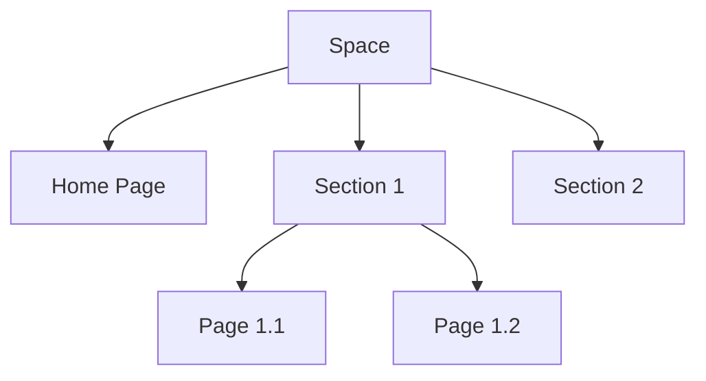

## Overview

Chaudhary Bawa organizes your project documentation into structured spaces. You build content using pages, sections, and hierarchies while leveraging version control and collaboration tools. Master these concepts to create scalable docs.

<Columns cols={2}>
  <Card title="Spaces" icon="database" href="#documentation-spaces">
    Container for related docs with custom structure.
  </Card>
  <Card title="Pages & Hierarchies" icon="file-text" href="#pages-sections-hierarchies">
    Nested content organization.
  </Card>
  <Card title="Version Control" icon="git-branch" href="#version-control">
    Track changes over time.
  </Card>
  <Card title="Collaboration" icon="users" href="#collaboration">
    Team editing and reviews.
  </Card>
</Columns>

## Documentation Spaces

Spaces act as top-level containers for your documentation. Create a space for each project or team to isolate content. Each space supports custom permissions, themes, and navigation.

<Steps>
  <Step title="Create a Space" icon="plus">
    Navigate to the dashboard and select "New Space".

    ```bash
    curl -X POST https://api.example.com/spaces \
      -H "Authorization: Bearer YOUR_API_KEY" \
      -d '{"name": "My Project Docs", "description": "Project documentation"}'
    ```
  </Step>
  <Step title="Configure Settings" icon="settings">
    Set brand color to `#3B82F6` and enable version history.
  </Step>
  <Step title="Add Pages" icon="file-plus">
    Start building your hierarchy.
  </Step>
</Steps>

<Callout kind="tip">
  Use one space per major project to simplify access control.
</Callout>

## Pages, Sections, and Hierarchies

Pages form the building blocks of your space. Organize them into sections with markdown headings and MDX components. Hierarchies emerge from nested pages and sidebar navigation.



Use YAML frontmatter on pages for metadata:

<CodeGroup tabs="Default,Advanced">
  ```yaml
  ---
  title: My Page
  description: Page summary
  ---
  ## Content starts here
  ```
  ```yaml
  ---
  title: Advanced Page
  description: Detailed summary
  tags: ["guide", "api"]
  ---
  ## Content with components
  ```
</CodeGroup>

## Version Control for Docs

Chaudhary Bawa provides built-in version control alongside Git integration. Track changes, revert edits, and compare versions without leaving your workspace.

<Tabs>
  <Tab title="Built-in" icon="git-commit">
    Automatic snapshots on every edit. View history via the page menu.
  </Tab>
  <Tab title="Git Sync" icon="github">
    Connect your repo for pull requests and branches.

    <ParamField path="repo" param-type="string" required="true">
      GitHub repository URL, e.g., `https://github.com/your-org/docs`.
    </ParamField>
  </Tab>
</Tabs>

<Callout kind="info">
  Enable Git sync in space settings for teams using external repos.
</Callout>

## Collaboration Basics

Invite team members to spaces with role-based permissions. Review changes, add comments, and resolve conflicts collaboratively.

<ExpandableGroup>
  <Expandable title="Roles Explained" default-open="true">
    - **Admin**: Full control, including space deletion.
    - **Editor**: Edit pages and manage pages.
    - **Viewer**: Read-only access.
  </Expandable>
  <Expandable title="Best Practices">
    Assign minimal permissions. Use `@mentions` in comments for notifications.
  </Expandable>
</ExpandableGroup>

| Role     | Edit Pages | Manage Users | Delete Space |
|----------|------------|--------------|--------------|
| Admin    | Yes        | Yes          | Yes          |
| Editor   | Yes        | No           | No           |
| Viewer   | No         | No           | No           |

<Columns cols={2}>
  <Card title="Quickstart" icon="rocket" href="/quickstart">
    Set up your first space.
  </Card>
  <Card title="Authentication" icon="lock" href="/authentication">
    Secure your team access.
  </Card>
</Columns>