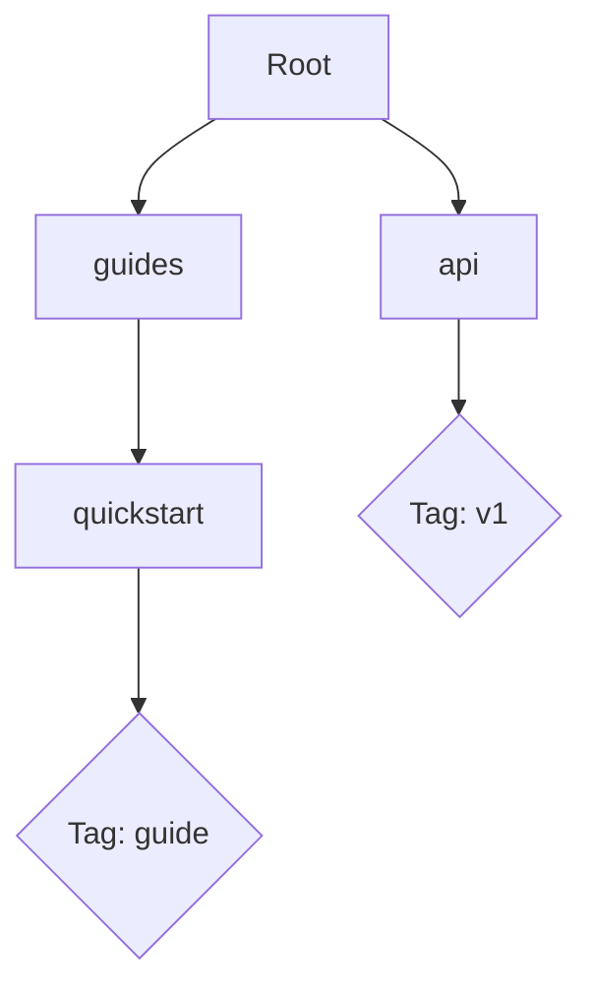

## Overview

Chaudhary Bawa provides powerful tools to manage your project documentation efficiently. You organize content using folders and tags, navigate with advanced search, export in multiple formats, and customize appearances to match your brand. These features help you create professional docs spaces tailored to your needs.

<Columns cols={2}>
  <Card title="Organize with Folders & Tags" icon="folder" href="#organizing-content">
    Structure your docs hierarchically and categorize with tags for easy management.
  </Card>
  <Card title="Search & Navigation" icon="search" href="#search-navigation">
    Find content quickly with full-text search and intuitive navigation tools.
  </Card>
  <Card title="Export & Share" icon="share-2" href="#exporting-sharing">
    Generate PDFs, HTML exports, or share links securely.
  </Card>
  <Card title="Customize Layouts" icon="palette" href="#customizing-layouts">
    Apply themes and layouts using simple configuration.
  </Card>
</Columns>

## Organizing Content with Folders and Tags

You create a clear structure for your documentation using folders and tags. Folders provide hierarchy, while tags enable cross-referencing and filtering.

<Steps>
  <Step title="Create Folders" icon="folder-plus">
    In your docs space, click the `New Folder` button. Name it `guides` or `api-reference`. Nest subfolders like `guides/quickstart`.
  </Step>
  <Step title="Add Tags" icon="tag">
    Edit any page and add tags in the frontmatter:
    
````yaml
tags: ["feature", "guide"]
````
  </Step>
  <Step title="Filter by Tags" icon="filter">
    Use the sidebar filter to view all pages tagged `guide`.
  </Step>
</Steps>

<Callout kind="tip">
  Combine folders and tags for hybrid organization. For example, keep API docs in `/api/` but tag endpoints with `v1` or `beta`.
</Callout>



## Search and Navigation Tools

Chaudhary Bawa offers robust search and navigation to help you locate content instantly.

<Tabs>
  <Tab title="Full-Text Search" icon="search">
    Type keywords in the global search bar. It indexes titles, content, and tags.
    
    <Image
      src="https://via.placeholder.com/800x400/3B82F6/white?text=Search+Results"
      alt="Search interface showing results for 'authentication'"
      width="800"
      height="400"
    />
  </Tab>
  <Tab title="Navigation Tools" icon="menu">
    Use the sidebar tree view for folders or tag clouds for quick jumps.
    
    Enable breadcrumbs in settings for path visualization: Home > Guides > Quickstart.
  </Tab>
</Tabs>

## Exporting and Sharing Documentation

You export your entire docs space or specific sections for offline use or sharing.

<Steps>
  <Step title="Export to PDF" icon="file-text">
    Select `Export > PDF` from the menu. Choose pages or entire space.
  </Step>
  <Step title="Generate Share Link" icon="link-2">
    Right-click a folder and select `Share`. Set permissions: view-only or edit.
  </Step>
  <Step title="HTML Archive" icon="globe">
    Export as a static site: `Export > HTML`. Host on any static server.
  </Step>
</Steps>

## Customizing Layouts and Themes

Tailor Chaudhary Bawa to your brand with custom themes. Edit the global config file.

<CodeGroup tabs="YAML,CSS">
````yaml
# config.yaml
theme:
  primaryColor: "#3B82F6"
  font: "Inter"
````

````css
/* custom.css */
:root {
  --primary: #3B82F6;
}

.navbar {
  background: var(--primary);
}
````
</CodeGroup>

<Expandable title="Advanced Theme Options" default-open="false">
  Override components:
  
````jsx
// theme-overrides.js
export default {
  Callout: {
    iconSize: "lg"
  }
}
````
</Expandable>

<Callout kind="success">
  Test customizations in preview mode before publishing.
</Callout>

These features make Chaudhary Bawa versatile for teams, from solo projects to enterprise docs. Start by organizing your first folder today.